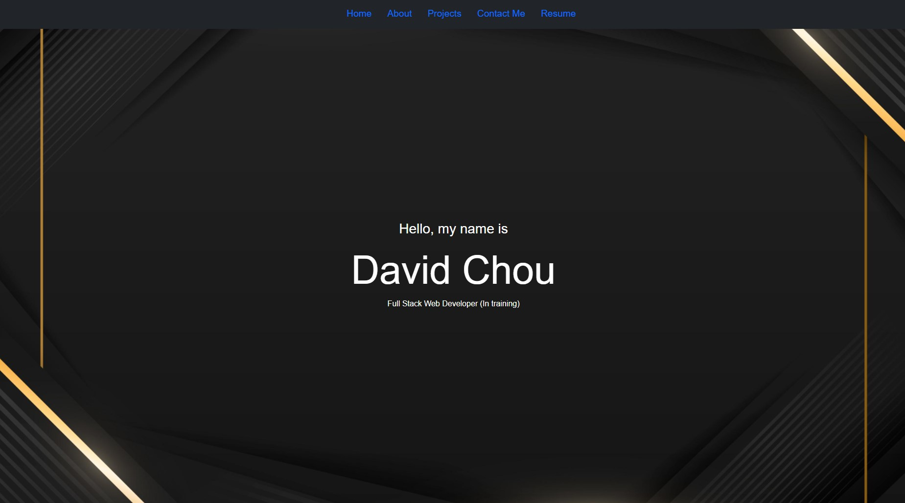
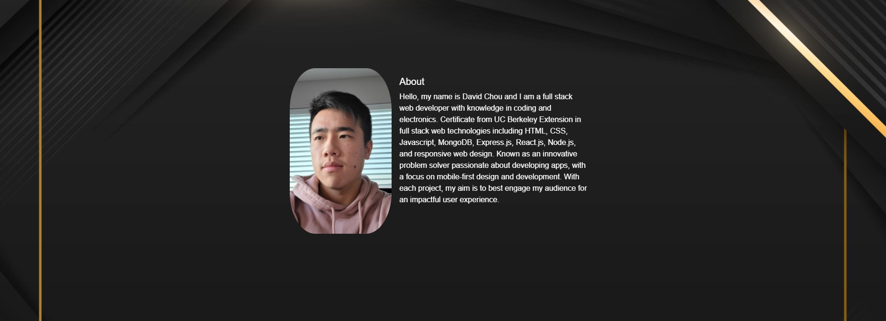
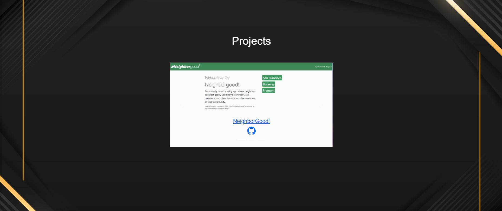
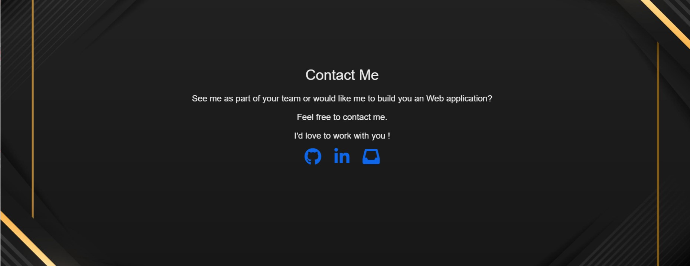

# Portfolio
# My-Portfolio

One paragraph of project description goes here.
For this project, I will create my own portfolio page where I can showcase my skills and talents to employers. I will be incorporating recently learned skills in order to design and effectively style my webpage. 

## Development

Knowing that I needed to have my name, photo, and links so sections about me, my work, and how to connect with me, it helped me layout my website and how I would structure it. So I simply began by creating a header and a nav bar with some simple styling at the top of the page and an image for the background. 

* 

Next, for the about me section, I added my image inline with a paragraph description about me.

* 

For the section regarding my work, I decided to put a few of my major works onto a carousel in which the user can browse through.

* 

And lastly, I made a simple section with my contact information and then centered it to finalize the website.

* 

## Built With

* [HTML](https://developer.mozilla.org/en-US/docs/Web/HTML)
* [CSS](https://developer.mozilla.org/en-US/docs/Web/CSS)

## Deployed Link

* [See Live Site](https://dazedchou.github.io/Portfolio/)

## Authors

* **David Chou** 

- [Link to Portfolio Site](https://dazedchou.github.io/My-Portfolio/)
- [Link to Github](https://github.com/dazedchou)
- [Link to LinkedIn](https://www.linkedin.com/in/davidchou99)

## License

This project is licensed under the MIT License 

